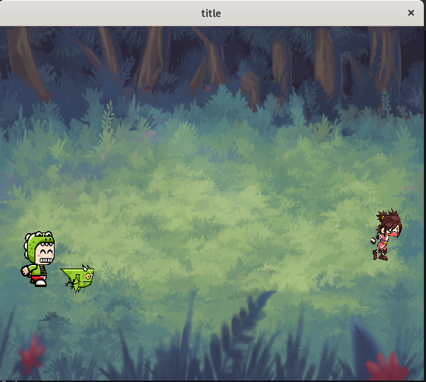

# Light Game Framework SDL2
Code is the result of the Following: https://www.youtube.com/channel/UCaKToiAPfhOgxqy7Wuyjkqw 
Each folder is the code that is created during the series.

# Demo Folder
A folder where I hope you might like to share your own creations with other viewers of the channel. 
Ways to get your code to this repo:

	Fork this repo then submit a pull request

	Open an issue on this repo

	Leave a comment on the yt channel

	Send me a link to your own github and I'll add it to this page

	
## Dragon Pong

A small demo of how the framework might be used to recreate a classic game. Using inheritence you can create child classes with different functionality than the parent class

