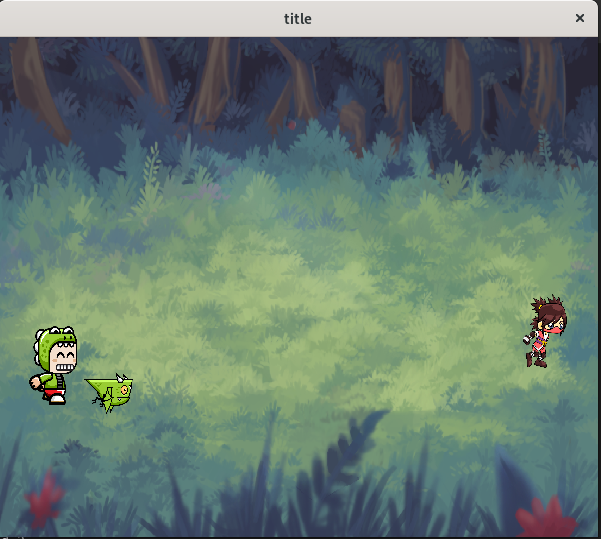

# Almost Pong

This is a pong/tennis based game in which Free Game Art is slammed together into a quick 2 player game.

## Controls:

w - player 1 up

s - player 1 down

arrow up = player 2 up

arrow down = player 2 down

## Build
On linux simply type the command "make" then run a.out

On other systems... open an IDE and add the programming files to that project and configure SDL2... Yeah.

I really hope the youtube videos are helpfull.

If you'd like to share your creations; crazy, brilliant, whacky, I'd like to see what you've come up with.

I will post them in the same demo folder as this should you choose to send me them.
